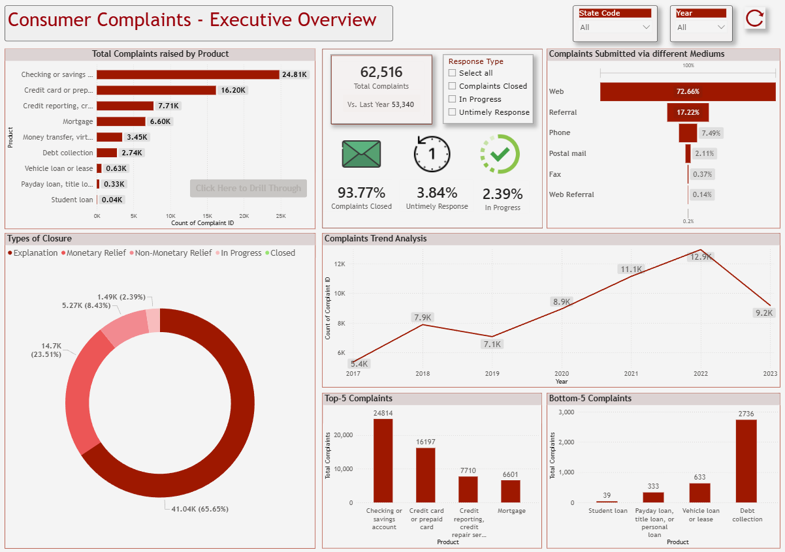
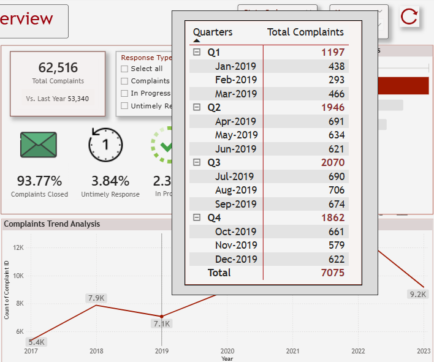

# 📊 Consumer Complaints Survey – Power BI Dashboard

## 📌 Project Overview
This project presents an interactive **Power BI dashboard** built to analyze consumer complaint data and derive actionable business insights. The dashboard focuses on complaint trends, product performance, resolution effectiveness, and response behavior to support executive-level decision-making.

---

## 🎯 Objectives
- Analyze consumer complaints across products, issues, and resolution types  
- Identify year-over-year (YoY) trends and seasonal patterns  
- Evaluate company response effectiveness and complaint closure outcomes  
- Highlight high-risk and low-risk products based on complaint volume  

---

## 🛠️ Tools & Technologies
- **Power BI Desktop**
- **DAX** (Measures & Calculations)
- **Power Query** (Data Transformation)
- Data Source: Consumer Complaints dataset (CFPB)

---

## 📊 Key Features & Visuals
- Product-wise complaint analysis using bar charts with drill-through to explore issue and sub-issue details  
- KPI cards to track year-over-year (YoY) complaint trends  
- Percentage breakdown of company response types to assess resolution effectiveness  
- Dynamic slicers for State, Year, and Response Type, including a **Clear All Filters** button  
- Funnel chart to analyze complaint submission channels  
- Donut chart showcasing complaint closure outcomes (monetary relief, non-monetary relief, explanations, in-progress)  
- Year-wise trend analysis using line charts with custom tooltips displaying quarter-wise distribution  
- Top 5 and Bottom 5 products by complaint volume  

---

## 🖼️ Dashboard Screenshots

> Below are sample views from the Power BI dashboard.  
> *(Screenshots are for preview purposes; interact with the `.pbix` file for full functionality.)*

### 🔹 Executive Overview

### 🔹 Product & Issue Analysis

### 🔹 Resolution & Response Effectiveness

### 🔹 Trend & YoY Analysis

📌 **Note:**  
Create a folder named `screenshots` in the repository root and upload the images with the same filenames, or update the paths accordingly.

---

## 📈 Business Insights Enabled
- Visibility into products generating the highest complaints  
- Understanding of resolution efficiency and compliance risks  
- Identification of dominant complaint submission channels  
- Support for executive-level, data-driven decisions  

---

## 📂 Repository Contents
- Power BI report file (`.pbix`)
- Screenshots folder
- README.md

---

## 🚀 How to Use
1. Download the `.pbix` file from the repository  
2. Open it using **Power BI Desktop**  
3. Use slicers, drill-throughs, and tooltips to explore insights  

---

## 📬 Author
**Manish Vaity**  
Power BI Developer | Business Intelligence  

---

## ⭐ Feedback
If you find this project useful, feel free to ⭐ star the repository or share feedback.
